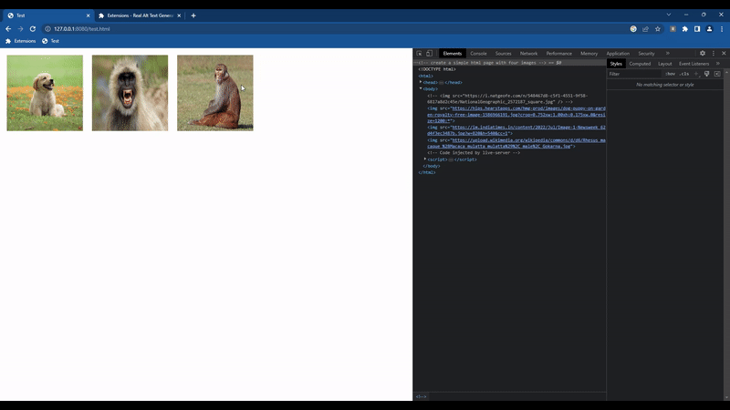

# Real Alt Text Generator Chrome Extension

This Chrome extension aims to improve web accessibility by providing a convenient way to generate real alt text for images. Alt text, also known as alternative text, is a textual description that is read by screen readers to provide a meaningful understanding of the images to users with visual impairments.

The Real Alt Text Genie extension leverages the power of the OFA-Image-Captioning model to generate accurate alt text for images. It utilizes the API provided by [https://ofa-sys-ofa-image-caption.hf.space/](https://ofa-sys-ofa-image-caption.hf.space/) to generate the alt texts.

## Features

- Automatic generation of real alt text for images on web pages
- One-click alt text generation for individual images
- Supports various image formats, including JPEG, PNG, GIF, and more
- Easy installation and seamless integration into the Chrome browser
- Intuitive user interface for a user-friendly experience

## Installation

1. Download the extension files from the [Real Alt Text Genie GitHub repository](https://github.com/beSaif/RealAltTextGen).
2. Open the Chrome browser and navigate to `chrome://extensions`.
3. Enable the **Developer mode** toggle switch in the top right corner of the page.
4. Click on the **Load unpacked** button and select the directory containing the extension files.
5. The Real Alt Text Genie extension should now appear in your Chrome browser's toolbar.

## Usage

1. Visit a web page containing images.
2. Click on the Real Alt Text Generator extension icon in the toolbar.
3. The extension will automatically generate real alt text for all the images on the page using the OFA-Image-Captioning model.

## Contributing

Contributions are welcome! If you have any ideas, suggestions, or bug reports, please open an issue on the [Real Alt Text Genie GitHub repository](https://github.com/beSaif/RealAltTextGen). We appreciate your feedback and contributions.

## To-Do

- Alternatively, you can right-click on an individual image and select **Generate Alt Text** from the context menu to generate alt text specifically for that image.

## License

This project is licensed under the [MIT License](LICENSE).

## Contact

For any questions or inquiries, please contact [hishamkolikara@gmail.com](mailto:hishamkolikara@gmail.com).
